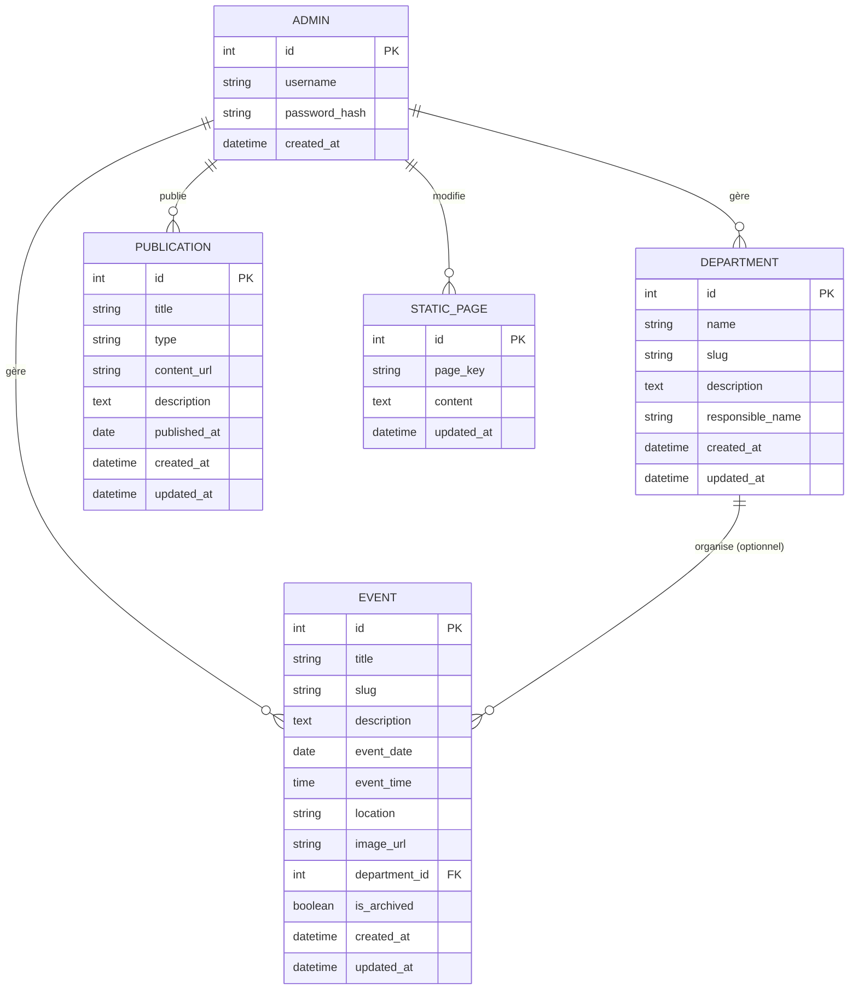

# Schéma de base de données

## Site web — Centre Chrétien Jésus ma Vie (CCJV)

*Version de base (MVP), SQL relationnel (PostgreSQL/MySQL)*

---

## 1. Diagramme entité-relation

---

## 2. Détail des tables

### 2.1 `admins`

Comptes administrateurs (rôle unique en V1).

| Champ | Type | Contraintes |
| --- | --- | --- |
| `id` | INTEGER | PK, auto-incrément |
| `username` | VARCHAR(50) | UNIQUE, NOT NULL |
| `password_hash` | VARCHAR(255) | NOT NULL (mot de passe haché, jamais en clair) |
| `created_at` | TIMESTAMP | NOT NULL, défaut = date d'insertion |

---

### 2.2 `departments`

Départements de l'église (chorale, etc.), liste alimentée librement via le back-office.

| Champ | Type | Contraintes |
| --- | --- | --- |
| `id` | INTEGER | PK, auto-incrément |
| `name` | VARCHAR(100) | NOT NULL |
| `slug` | VARCHAR(120) | UNIQUE, NOT NULL (généré depuis `name`) |
| `description` | TEXT | Nullable |
| `responsible_name` | VARCHAR(100) | Nullable |
| `created_at` | TIMESTAMP | NOT NULL |
| `updated_at` | TIMESTAMP | NOT NULL |

---

### 2.3 `events`

Événements (cultes spéciaux, activités adultes/enfants, activités de département).

| Champ | Type | Contraintes |
| --- | --- | --- |
| `id` | INTEGER | PK, auto-incrément |
| `title` | VARCHAR(150) | NOT NULL |
| `slug` | VARCHAR(180) | UNIQUE, NOT NULL |
| `description` | TEXT | Nullable |
| `event_date` | DATE | NOT NULL |
| `event_time` | TIME | Nullable |
| `location` | VARCHAR(150) | Nullable |
| `image_url` | VARCHAR(255) | Nullable |
| `department_id` | INTEGER | FK → `departments.id`, Nullable (événement général si vide) |
| `is_archived` | BOOLEAN | NOT NULL, défaut = false (bascule automatiquement à true une fois la date passée) |
| `created_at` | TIMESTAMP | NOT NULL |
| `updated_at` | TIMESTAMP | NOT NULL |

**Index recommandé** : `(event_date, is_archived)` pour accélérer l'affichage des événements à venir.

---

### 2.4 `publications`

Publications médias (vidéo, photo, texte).

| Champ | Type | Contraintes |
| --- | --- | --- |
| `id` | INTEGER | PK, auto-incrément |
| `title` | VARCHAR(150) | NOT NULL |
| `type` | ENUM('video','photo','texte') | NOT NULL |
| `content_url` | VARCHAR(255) | Nullable (lien vidéo YouTube/Facebook, ou chemin image) |
| `description` | TEXT | Nullable |
| `published_at` | DATE | NOT NULL |
| `created_at` | TIMESTAMP | NOT NULL |
| `updated_at` | TIMESTAMP | NOT NULL |

**Index recommandé** : `(published_at DESC)` pour l'affichage chronologique.

---

### 2.5 `static_pages`

Contenu éditable des pages fixes (Accueil, Qui sommes-nous).

| Champ | Type | Contraintes |
| --- | --- | --- |
| `id` | INTEGER | PK, auto-incrément |
| `page_key` | VARCHAR(50) | UNIQUE, NOT NULL (ex. `accueil`, `qui-sommes-nous`) |
| `content` | TEXT | NOT NULL (texte riche / HTML simple) |
| `updated_at` | TIMESTAMP | NOT NULL |

---

## 3. Relations

- Un **événement** peut optionnellement appartenir à un **département** (`events.department_id`). Si vide, l'événement est considéré comme général (adultes/enfants/église entière).
- Les **publications** et **pages statiques** ne dépendent d'aucune autre table — elles sont autonomes.
- Aucune relation n'est faite entre `admins` et les autres tables au niveau base de données en V1 (traçabilité de l'auteur non requise pour cette version) ; à ajouter plus tard si besoin (`created_by`).

---

## 4. Règles complémentaires

- Les `slug` sont générés automatiquement à partir du titre/nom, en minuscules et sans accents, pour des URLs propres (ex. `/evenements/culte-de-noel`).
- `is_archived` peut être calculé à la volée (comparaison `event_date < aujourd'hui`) plutôt que stocké, selon le choix technique final — l'un ou l'autre fonctionne pour une V1.
- Prévoir des sauvegardes régulières de la base (voir document Architecture technique, §4).

---

## 5. Évolutions possibles (hors V1)

- Table `media` séparée si une publication doit contenir plusieurs images/vidéos
- Table `users` pour des comptes membres (espace connecté)
- Champ `created_by` sur les tables pour tracer l'auteur, si plusieurs administrateurs